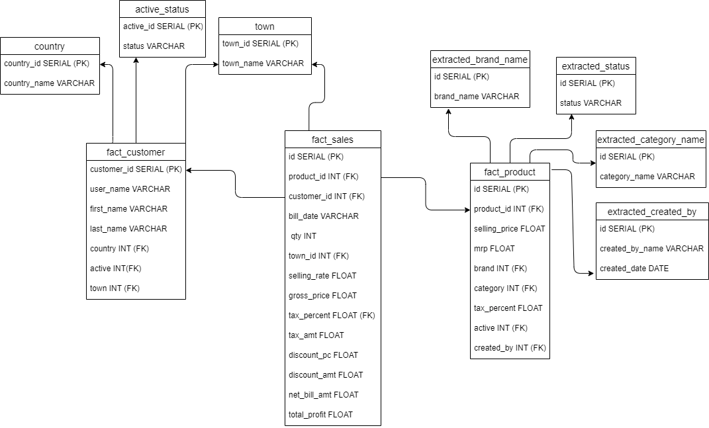

# E-commerce
E-commerce is the activity of electronically buying or selling of products on online services. It draws on technological advancemant. It draws the automation on data collection system. For the analysis of such a drven unmanaged data, a well prepared database is required so that we can get the insight through the collected data. So, I have tried to develope a datawarehourse that will help the investor to invest in such product which are fast selling and also those product which will produce high profit by removing the product that are not doing so good. For developing such dataware house I have choosed `fact constellation schema` that contains 3 fact tables. They are :: 
- fact_sales
- fact_product
- fact_customer

## Requirements:
- The datawarehouse must be able to extract those data which are most sold.
- The datewarehouse must be able to extract the town in which the specific product are sold most. 
- The datawarehouse must be able to so which customer is most frequent and buys which product.
- The dataware house must be able to show the total profit in selling the product.

## Conceptual Design

[image_link](https://drive.google.com/file/d/13r_n7prWbiLw8PLytUU0u6ABN46CZyng/view?usp=sharing)

## Physical Design

[image_link](https://drive.google.com/file/d/13r_n7prWbiLw8PLytUU0u6ABN46CZyng/view?usp=sharing)

# Physical Implementation

## Setting up the setup for managing the relative path
Initially for  importing the packages using relative path I have install the setup.py file using following command
    pip install -e .
This will find all the packages and setup it to the project

## Establishing Connection:
For establishing the connection with postgresql database we used the psycopg2 package. 

## Utils package
The utils package includes the codes which might get repeatedly called during the execution of program. It includes:
### connect() ###
    This function will connect to the postgres database.
### sql_path(path)
    This fuction will read the sql from the sql path and return it to the program.

## Creating the schema:
Here I have maintained all the temporary tables for each attributes needed. `raw_employee, raw_timestamp, dim_department,  temporary_punch_detail, temporary__hours_worked, etl.temporary_attendance, temporary_break_taken, temporary_break_hour, temporary_charge_status, temporary_charge_hour, temporary_on_call_status, temporary_on_call_hour, temporary_num_teammates_absent`.
### raw_employee, raw_timestamp ###
These table includes the raw data directly from raw files
### dim_department ###
This table includes the index to distinct department along with department name and department id.
### temporary_punch_detail ###
In this table I have place the `employee id, shift_start_time by extracting the minium time from punch_in_time , shift_end_time by extracting the maximum time from punch_out_time, shift_date using the case statement` as:  
```
SELECT employee_id,
           d.id,
           MIN(punch_in_time::TIMESTAMP::TIME)  AS shift_start_time, #extacting time
           MAX(punch_out_time::TIMESTAMP::TIME) AS shift_end_time, #extacting time
           CAST(punch_apply_date AS DATE) AS shift_date,
           CASE
               WHEN punch_in_time::TIMESTAMP::TIME BETWEEN '05:00' AND '11:00'::TIME THEN 'Morning'
               WHEN punch_in_time::TIMESTAMP::TIME >= '12:00'::TIME THEN 'Evening'
               ELSE NULL END AS shift_type
    FROM etl.raw_timestamp e LEFT JOIN etl.dim_department d on e.cost_center = d.client_department_id
    group by employee_id, punch_apply_date, employee_id, punch_out_time, punch_in_time, d.id
```
Here the punch_apply_date has been cast to DATE format which was previously in VARCHAR format.

### temporary_hours_worked ###
Here I have cast the hours_worked attribute to float and made the aggregration sum when the `paycode = 'WRK'` grouping by employee_id, punch_apply_date, hours_worked.
```
SELECT
        SUM(CAST(hours_worked AS FLOAT)) AS hours_worked
    FROM etl.raw_timestamp
    WHERE paycode = 'WRK'
    GROUP BY employee_id, punch_apply_date, hours_worked
```
### temporary_attendance ###
Here I have primarily grouped the table by employee_id, punch_apply_date and sum the hours_worked after casting it to float by selecting the hours_worked having paycode to `'WRK' and 'CHARGE'`. Here I have maintained the threshold that if the sum of the hours_worked having pay code to 'wrk' and 'charge' is greater than 2.0 raise the attendance flag to 'T'else the attendance flag till set to 'F'.
```
SELECT CAST(CASE
                    WHEN SUM(CAST(hours_worked AS FLOAT)) > '2.0' THEN 'T'
                    ELSE 'F' END AS BOOLEAN) AS attendance
    FROM etl.raw_timestamp
    WHERE paycode IN ('WRK', 'CHARGE')
    GROUP BY employee_id, punch_apply_date
```
### temporary_break_taken ###
Here after grouping the table by employee_id, punch_apply_date with paycode = 'BREAK', I have cast the hours_worked to float and added by using aggegreation function SUM(). If the sum value >0.0 then it indicates that employee with employee_id has taken break on that date. Thus the flag will set to T else the flag will set to F.
```
SELECT
       CAST(CASE WHEN SUM(CAST(hours_worked AS FLOAT)) > '0.0' THEN 'T'
        ELSE 'F' END AS BOOLEAN) AS has_taken_break
    FROM etl.raw_timestamp WHERE paycode = 'BREAK' GROUP BY employee_id, punch_apply_date
```
This is as same as `temporary_hours_worked`. Here only difference is that, the paycode with BRAK are only selected and made the sum.
Similar to `temporary_break_taken; temporary_charge_status, temporary_on_call_status` and `temporary_hours_worked; temporary_charge_hour, temporary_on_call_hour` only by canging the where clause to 'CHARGE', 'ON_CALL' respectively.
### temporary_num_teammates_absent ###
Here, after grouping the table by cost_center, paycode, punch_apply_date the rows with paycode = 'ABSENT' are selected and count it to get the number of teammates absent in certain department on the date. 
```
SELECT
           COUNT(paycode) AS num_teammates_absent
    FROM etl.raw_timestamp
    WHERE paycode = 'ABSENT'
    GROUP BY cost_center, paycode, punch_apply_date
```
